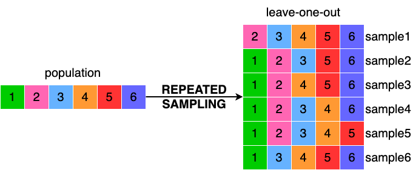

<!-- README.md is generated from README.Rmd. Please edit the README.Rmd file -->

# resampling

**resampling** is an R package providing ready-to-use functions to take
repeated samples from a population.

The idea behind **resampling** is to provide different sampling
techniques commonly used in machine learning (such as random sampling
with and without replacement, k-fold sampling, leave-p-out sampling) in
a single R package.



## Installation

You can install latest development version from GitHub (requires
[devtools](https://github.com/hadley/devtools) package):

``` r
if (!require("devtools")) {
  install.packages("devtools")
}

devtools::install_github(
  repo = "alebarberis/resampling", 
  dependencies = TRUE, 
  build_vignettes = FALSE
)
```

## Getting started

If you are just getting started with **resampling**, we recommend
looking at the [Getting Started](articles/resampling.html) section of
the site.
